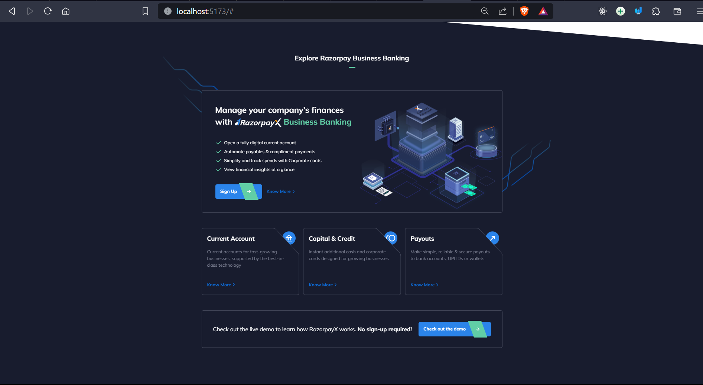
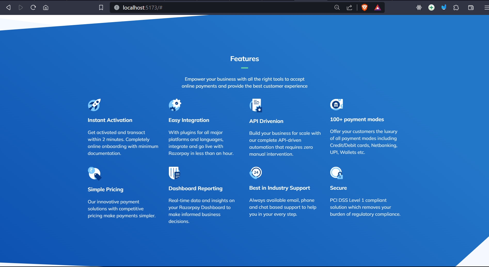
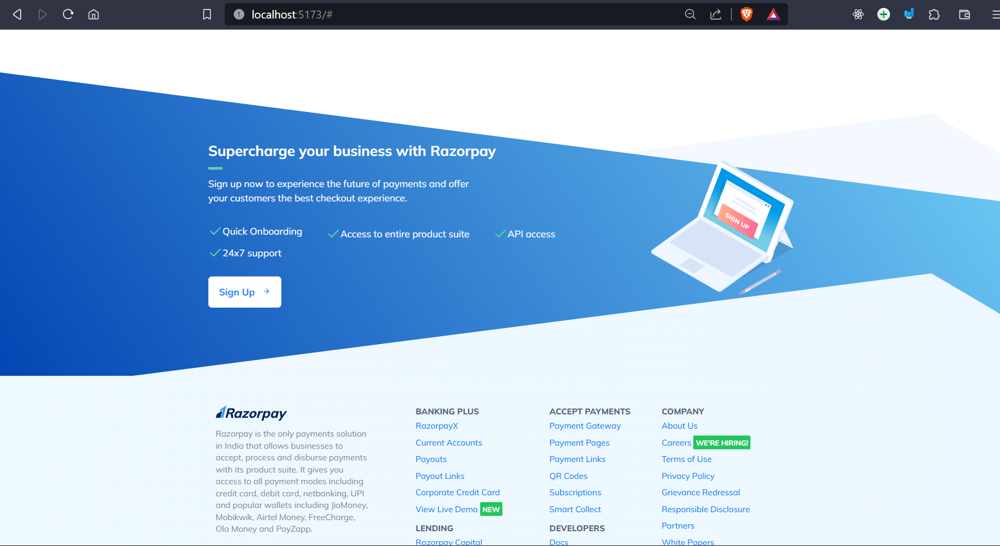

# RazorPay Clone

**Description:** This project is a clone of a business website, showcasing various sections such as testimonials, business offerings, and a comprehensive footer with detailed information.

## Table of Contents

1. [Introduction](#introduction)
2. [Features](#features)
3. [Deployed Website](#deployed-website)
4. [Technologies Used](#technologies-used)
5. [How to Use](#how-to-use)
6. [License](#license)
7. [Acknowledgements](#acknowledgements)

## Introduction

This project is a clone of a modern business website, providing a user-friendly and visually appealing online presence for businesses. It includes sections for user testimonials, details about the services offered, and a comprehensive footer with detailed information about the company.

## Features

- **Testimonials Section:** A dedicated section for showcasing user testimonials, including a slider for multiple testimonials.
- **Business Offering Section:** Highlighting key features or offerings with relevant icons and descriptions.
- **Call-to-Action Section:** Encourages users to sign up for the service with a visually appealing layout and clear call-to-action buttons.
- **Footer:** Comprehensive footer with detailed information about the company, including links to various sections, resources, and social media.

## Deployed Website

The cloned website is deployed and can be accessed [here](https://razorpay-clone007.netlify.app/).
```
Their is a Issue with some Image not being displayed on the deployed site 
Instead you can run it on your local Host.
```

## Missing Section







## Technologies Used

- HTML
- Tailwind CSS
- SVG for icons

## How to Use

1. Clone the repository.
2. Open the `index.html` file in a web browser to view the cloned website.

## धन्यवाद